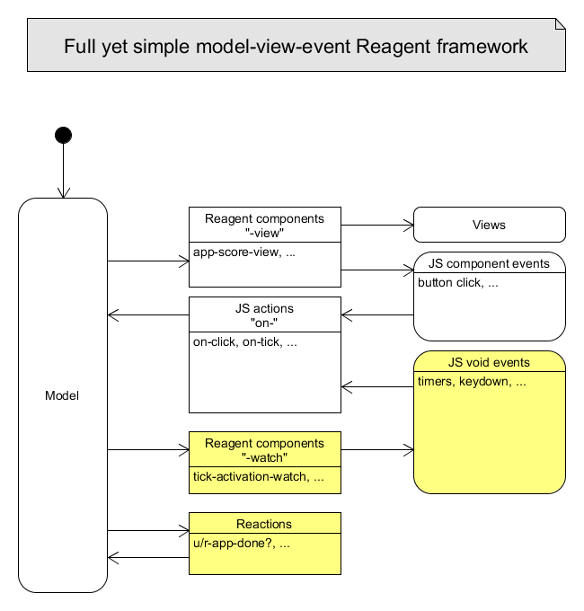
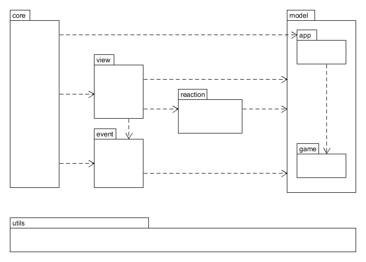

# Twotris

This project is a double Tetris game written with ClojureScript/Reagent largely inspired from **Timothypratley** blog [post](http://timothypratley.blogspot.fr).

## Overview

Before you go on, you halt a moment to play [Twotris](http://cturle.github.io/twotris.html) online to see what it is about.

Last online game update = version 1.3.1 (2015-08-22)

It is written as a single page application to demonstrate how to use Reagent from ClojureScript.

## Full yet simple model-view-event Reagent framework

[Reagent](https://github.com/reagent-project/reagent) is a great library to make Single Page Application with ClojureScript. It is simple and very clojurish but you may need some advices to direct your project. Here, i will present a simple but full framework i have elaborated to help me design my Reagent projects.

Out of the box, Reagent tells you (white boxes) how to :
- Update views from model. You do this by using Reagent component and Reagent atoms. When atoms are updated, component auto-magically update your views. This is heart of Reagent / React.
- Handle Javascript component events (button clicks, ...). Just put your function which updates your model in the html generated : {:on-click my-on-click-button-handler-function}.

What is missing is how to manage :
- Derived states. These are states which are not explicitly represented in the app r-atom. They are functionnaly derived from explicit states or other derived states. The Reagent 'reaction' macro is the key here but some official documentation is missing. Thanks to [re-frame](https://github.com/Day8/re-frame) to point to this facility.
- Javascript void events. These are events which are not linked to DOM components. Ex: Timers, keydown ... Actually, people use some ad-hoc init functions to do the work. The goal here is to manage these events from the model, like views.

### Reactions to manage derived states

towrite

### Watch components to manage JS void events

towrite

### Package dependencies to structure your project

towrite

## Setup

To get an interactive development environment run:

    lein figwheel

and open your browser at [localhost:3449](http://localhost:3449/).
This will auto compile and send all changes to the browser without the
need to reload. After the compilation process is complete, you will
get a Browser Connected REPL. An easy way to try it is:

    (js/alert "Am I connected?")

and you should see an alert in the browser window.

To clean all compiled files:

    lein clean

To create a production build run:

    lein cljsbuild once min

And open your browser in `resources/public/index.html`. You will not
get live reloading, nor a REPL.

## Differences from original code

Original code from **timothypratley** is hosted on [Github](https://github.com/timothypratley/tetris).

Below, i list the differences from original code.

- 2 Tetris boards at the same time. Just to add some fun.
- global variables use ++ syntax. Ex: '+on-tick-interval+'
- local variables are always in uppercase. Ex: 'KEYNAME'

## Todos

Todos list in order of priority :

- reagent 0.5.1-rc
- try not to use "-watch" to handle Pure Data Reaction (not used in Views).
- `u/r-Map*Index_r-Any`
- +status+ => +status-name-map+
- handle game keydown as app keydown ()
- refactor button-view
- tweet 'the'
- write 'overview' section
- write Framework section
- write 'differences' section
- **blog it**
- **tweet it**

## Versions

1.3.x : 'Return' shortcut for Start/Restart + 'App commands :' view
1.2.x : +azerty/qwerty mode
1.1.x : +Easy/Moderate/Hard Mode
1.0.4 : +tick-period using framework
1.0.3 : +keydown-activation using framework
1.0.2 : +tick-activation using framework
1.0.1 : +fix on-keydown to be activated by a view from model.

## License

Copyright © 2015

Distributed under the Eclipse Public License either version 1.0 or (at your option) any later version.
